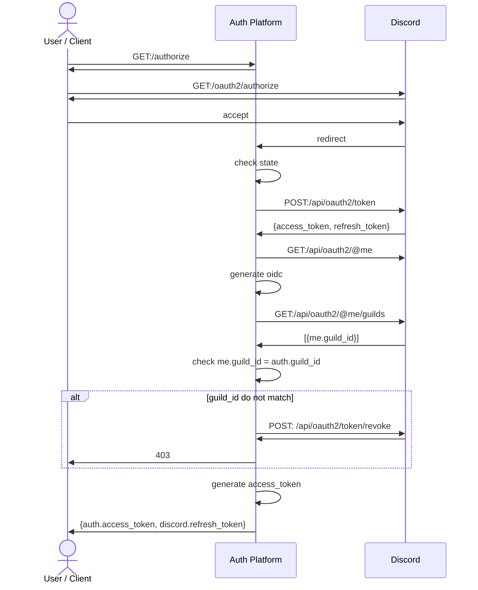
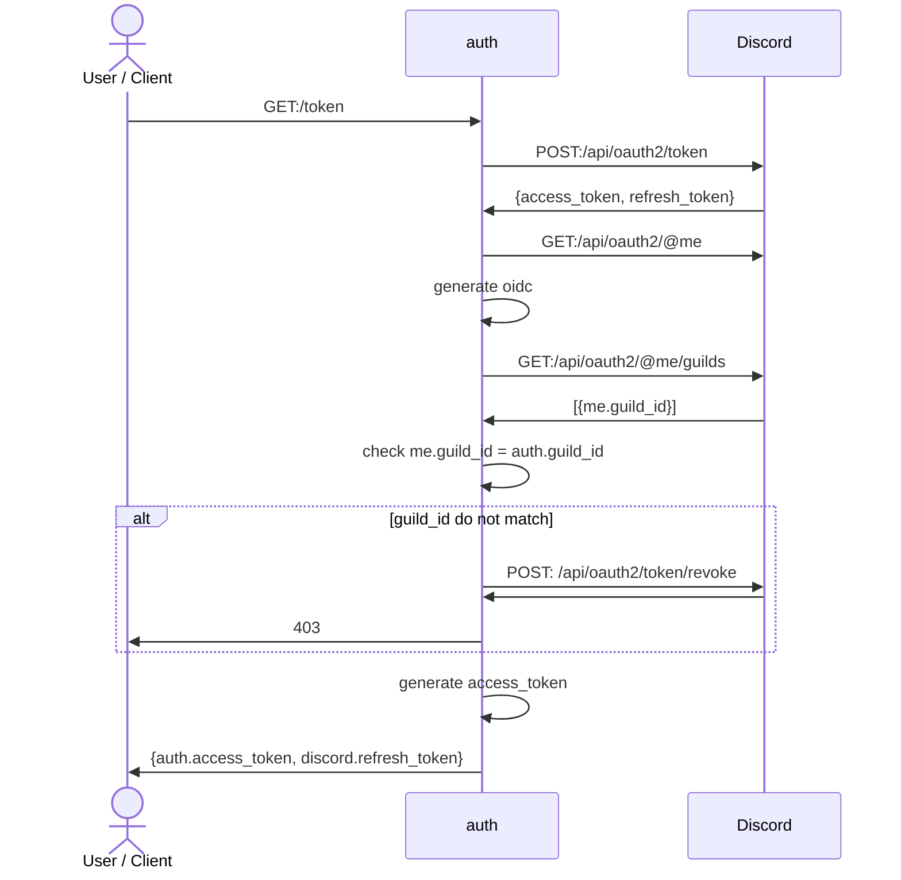

### Token Generate

```mermaid
sequenceDiagram
    actor user as User / Client
    participant auth as Auth Platform
    participant discord as Discord

    user->>auth: GET:/authorize
    auth->>user: 
    user->>discord: GET:/oauth2/authorize
    discord->>user: 
    user->>discord: accept
    discord->>auth: redirect
    auth->>auth: check state
    auth->>discord: POST:/api/oauth2/token
    discord->>auth: {access_token, refresh_token}
    auth->>discord: GET:/api/oauth2/@me
    auth->>auth: generate oidc
    auth->>discord: GET:/api/oauth2/@me/guilds
    discord->>auth: [{me.guild_id}]
    auth->>auth: check me.guild_id = auth.guild_id
    alt guild_id do not match
        auth->>discord: POST: /api/oauth2/token/revoke
        discord->>auth: 
        auth->>user: 403
    end
    auth->>auth: generate access_token
    auth->>user: {auth.access_token, discord.refresh_token}
```

### Token Refresh

```mermaid
sequenceDiagram
    actor user as User / Client
    participant auth as auth
    participant discord as Discord

    user->>auth: GET:/token
    auth->>discord: POST:/api/oauth2/token
    discord->>auth: {access_token, refresh_token}
    auth->>discord: GET:/api/oauth2/@me
    auth->>auth: generate oidc
    auth->>discord: GET:/api/oauth2/@me/guilds
    discord->>auth: [{me.guild_id}]
    auth->>auth: check me.guild_id = auth.guild_id
    alt guild_id do not match
        auth->>discord: POST: /api/oauth2/token/revoke
        discord->>auth: 
        auth->>user: 403
    end
    auth->>auth: generate access_token
    auth->>user: {auth.access_token, discord.refresh_token}
```